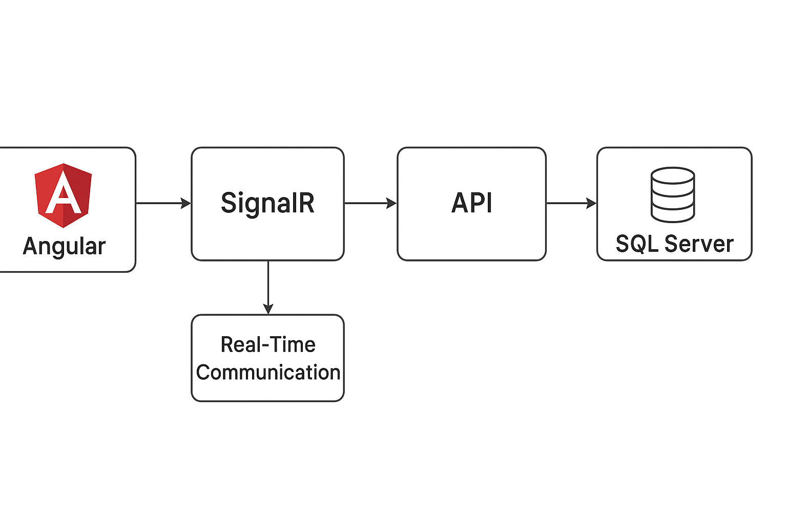

# 🏀 Marcador de Básquet en Tiempo Real

Aplicación de **marcador de básquetbol** con soporte para **sincronización en múltiples pantallas** usando **SignalR**, **Angular** y **.NET 9**.  
El proyecto está preparado para correr tanto de manera local como dentro de **Docker**.

---
### Arquitectura del proyecto 




### 📦 Requisitos previos

Para correr el proyecto **sin Docker**, necesitas tener instalado:

- **Node.js 20+**
- **Angular CLI 20.1.3**
- **.NET SDK 9.0.301**
- **SQL Server 2022** (local o en contenedor)

Verifica versiones con:

```bash
ng version
dotnet --version
```
### Estructura del proyecto

```plaintext
marcador-basket/
├── backend/
│   └── Scoreboard.Api/
│       ├── Controllers/
│       ├── Data/
│       ├── Hubs/
│       ├── Models/
│       ├── Program.cs
│       ├── Scoreboard.Api.csproj
│       └── Dockerfile
│
├── frontend/
│   └── scoreboard/
│       ├── src/
│       │   ├── app/
│       │   │   ├── app.ts
│       │   │   ├── app.html
│       │   │   ├── app.css
│       │   │   └── services/scoreboard.service.ts
│       │   └── environments/
│       │       ├── environment.ts
│       │       └── environment.prod.ts
│       ├── package.json
│       └── Dockerfile
│
├── docker-compose.yml
└── README.md

### Endpoints principales

1. POST /api/games → Crear nuevo juego

2. GET /api/games/{id} → Obtener estado de un juego

3. POST /api/games/{id}/score?team=home&points=2 → Registrar puntos

4. POST /api/games/{id}/foul?team=away → Registrar falta

4. POST /api/games/{id}/quarter/next → Pasar al siguiente cuarto

6 .POST /api/games/{id}/finish?status=paused → Cambiar estado (running, paused, finished, canceled, suspended)
```


### SignalR Hub

```bash
/hub/game
```

### Eventos emitidos:

- ScoreUpdated

- FoulUpdated

- QuarterUpdated

- GameStatusUpdated

- GameCreated

### 📌 Funcionalidades

- Iniciar un nuevo juego

- Registrar puntos y faltas

- Avanzar de cuarto automáticamente al acabar el tiempo

- Pausar, reanudar, finalizar, cancelar o suspender un juego

- Sincronización en tiempo real entre múltiples pantallas vía SignalR
  
# 📌 Configuración de entornos

- src/environments/environment.ts (desarrollo):

```ts
export const environment = {
  production: false,
  api: 'http://localhost:5071/api/games',
  hub: 'http://localhost:5071/hub/game'
};

```
- src/environments/environment.prod.ts (Produccion docker):
- 
```ts
export const environment = {
  production: false,
  api: 'http://api:8080/api/games',
  hub: 'http://api:8080/hub/game'
};

```
### Base de datos 

- Crear la base de datos marcadorbasket en SQL Server

```bash
docker run -e "ACCEPT_EULA=Y" -e "SA_PASSWORD=123456" -p 1433:1433 -d mcr.microsoft.com/mssql/server:2022-latest

```

### Migraciones EF core

1. Instalar herramientas EF Core (si no las tenemos)
```bash
dotnet tool install --global dotnet-ef

```
2. Creacion migracion
```bash
dotnet ef migrations add InitialCreate -p backend/Scoreboard.Api

```
2. Aplicar migracion a la base de datos
```bash
dotnet ef database update -p backend/Scoreboard.Api

```
### Ejecucion en Desarrollo

```bash
cd backend/Scoreboard.Api
dotnet run

```
* Por defecto el proyecto escucha a localhost:5071
* Swagger: http://localhost:5071/swagger
  
### Fronted Angular 

```bash
cd frontend/Scoreboard.Web
ng serve
```
* Abrir navegador y ir a http://localhost:4200

### Ejecutar en Docker

```yaml
services:
  api:
    build:
      context: ./backend
      dockerfile: Scoreboard.Api/Dockerfile
    container_name: scoreboard-api
    environment:
      - ConnectionStrings__Sql=Server=db,1433;Database=ScoreboardDb;User=sa;Password=VcunBlopez123;TrustServerCertificate=True
      - Scoring__FoulPenalty=1
    ports:
      - "5071:8080"
    depends_on:
      - db
    networks:
      - scoreboard-net

  frontend:
    build:
      context: ./frontend/scoreboard
      dockerfile: Dockerfile
    container_name: scoreboard-frontend
    ports:
      - "4200:80"
    depends_on:
      - api
    networks:
      - scoreboard-net

  db:
    image: mcr.microsoft.com/mssql/server:2022-latest
    container_name: db
    environment:
      - ACCEPT_EULA=Y
      - SA_PASSWORD=VcunBlopez123
    ports:
      - "14333:1433"
    networks:
      - scoreboard-net

networks:
  scoreboard-net:
    driver: bridge

```
### Levantar los contenedores

```bash
docker-compose up --build

ng serve
```
* Frontend: 👉 http://localhost:4200

* API (Swagger): 👉 http://localhost:5071/swagger

### Uso del sistema

* Nuevo Juego → crea un partido y arranca el marcador.
* Iniciar → arranca el reloj y cambia estado a running.
*Pausar/Reanudar → pausa/reanuda el cronómetro y sincroniza con DB.
* Finalizar/Cancelar/Suspender → termina el partido y guarda en DB.
* Sincronización en tiempo real → múltiples pantallas reciben cambios gracias a SignalR.

### Notas importantes

* En desarrollo local se usa:
     * API → http://localhost:5071/api/games
     * Hub SignalR → http://localhost:5071/hub/game

* En Docker se ajustan las URLs en environment.prod.ts.

* El cronómetro NO se sincroniza aún entre pantallas (sólo los datos del partido).
Para sincronizarlo habría que usar StartedAt y PausedAt desde DB.

### Versiones usadas
Angular CLI: 20.1.3
* .NET SDK: 9.0.301
* Node.js: 20.x
* SQL Server: 2022
* Docker Desktop: 4.x